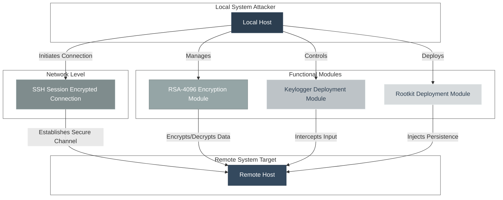
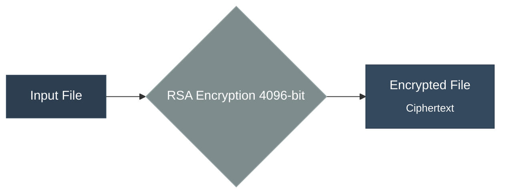
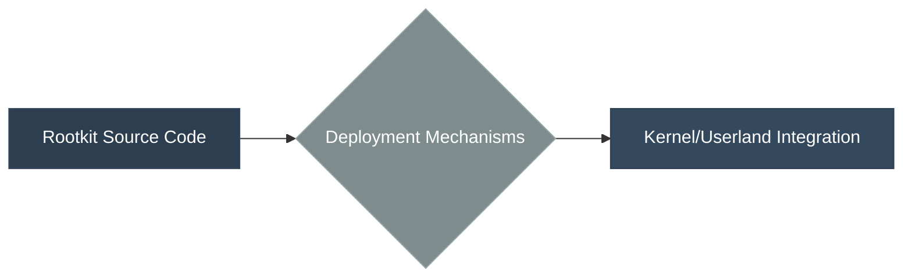
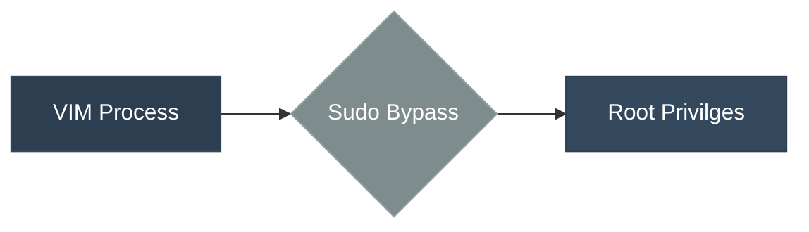

# White Matter SSH Rootkit Tool

## Overview

This comprehensive SSH tool provides advanced capabilities for penetration testing, red team operations, and security research. It combines multiple techniques including RSA-4096 encryption, remote keylogging, rootkit deployment, and VIM-based privilege escalation.

## Architecture Diagram


## Core Components

### 1. SSH Session Management

    - Initialization: Establishes secure SSH connections with configurable ports

    - Authentication: Supports password brute-forcing and public key authentication

    - Session Handling: Robust connection management with proper cleanup

### 2. RSA-4096 Encryption Engine



#### Key Features:

    4096-bit RSA key generation

    File and directory encryption/decryption

    Secure key management

    Support for both local and remote operations

### 3. Remote Keylogger System


#### Capabilities:

    Stealth operation (daemon mode)

    Remote log retrieval

    Process hiding techniques

### 4. Rootkit Deployment Framework



#### Deployment Methods:

    VIM privilege escalation exploits

    Direct kernel module loading

    Userland LD_PRELOAD techniques

    Multiple fallback mechanisms

### 5. VIM Exploit Engine



#### Exploit Techniques:

    VIM command execution bypass

    Automated password injection

    Root shell access

    Module hiding/showing

## Usage Examples

### Basic SSH Connection

```bash
./white_matter ip username -P passwords.txt
```

### File Encryption

```bash
# Encrypt remote file
./white_matter ip username -ef /path/to/file

# Encrypt remote directory
./white_matter ip username -ed /path/to/directory
```

### Keylogger Operations

```bash
# Start keylogger
./white_matter ip username -K

# Download logs
./white_matter ip username -G /local/path/logs.txt
```

### Rootkit Deployment

```bash
# Deploy via VIM exploit
./white_matter ip username -deploy-rootkit-vim

# Load specific rootkit
./white_matter ip username -load-rootkit-vim-exploit /path/to/rootkit.ko
```

## Encryption Workflow

1. Initialize SSH Session
2. Generate RSA Keys (if needed)
3. Transfer File to Temporary Location
4. Encrypt with RSA-4096
5. Upload Encrypted File
6. Cleanup Temporary Files
7. Store Decryption Key Remotely

## Rootkit Deployment Workflow

1. Establish SSH Connection
2. Compile Rootkit on Target
3. Attempt Multiple Loading Methods:
   - VIM Exploit (Primary)
   - Direct Syscalls (Fallback)
   - Userland Techniques (Secondary)
4. Verify Module Loading
5. Setup Persistence
6. Cleanup Evidence

## Offensive Features

Encryption Security

    Key Strength: 4096-bit RSA

    Padding: OAEP padding for semantic security

    Key Storage: Secure temporary storage with cleanup

    Transport: Encrypted SSH channel for all operations

Stealth Techniques

    Process hiding via kernel hooks

    File hiding using advanced attributes

    Log manipulation prevention

    Anti-forensics measures

Persistence Mechanisms

    System service installation

    LD_PRELOAD manipulation

    RC script modification

    Hidden file replication

## Detection Avoidance

Network Level

    SSH protocol encryption

    Normal-looking traffic patterns

    Randomized timing for operations

    Encrypted payloads within SSH

Host Level

    Hidden processes and files

    Kernel module manipulation

    Log cleaning capabilities

    File attribute modification

## Target Compatibility

### Supported Systems

    Linux Distributions: Debian 12 (in future will extend)

    Architectures: x86_64

    Kernel Versions: 3.x - 6.x

### Prerequisites

    SSH server on target

    Basic utilities (gcc, make, vim)

    Kernel headers (for rootkit compilation) (optional)

⚠️ Legal and Ethical Considerations

This tool is designed for:

    Authorized penetration testing

    Security research and education

    Defensive security training

### Warning: Unauthorized use of this tool is illegal. Always obtain proper permissions before testing systems.

## Dependencies

- libssh-dev          - SSH client library

- libssl-dev          - OpenSSL cryptographic functions

- pthread             - Multi-threading support

## Build Requirements

```bash
gcc -o white_matter white_matter -lssh -lcrypto -lm -lpthread
```

## File Structure

ssh_tool
├── Core SSH Functions
├── RSA Encryption Engine
├── Keylogger System
├── Rootkit Framework
├── VIM Exploit Module
└── Utility Functions
